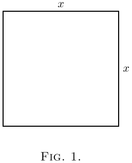

# О сравнительных изменениях

Во всём исчислении мы имеем дело с величинами, которые изменяются,
и со скоростями этих изменений.
Мы делим все величины на два класса: постоянные и переменные.

Те, которые мы считаем фиксированными, называются **постоянными**
и обозначаются обычно буквами из начала алфавита — такими, как $a$, $b$, или $c$.

А те, которые могут меняться,
или (как говорят математики) *«варьироваться»*,
мы обозначаем буквами из конца алфавита — такими, как $x$, $y$, $z$, $u$, $v$, $w$,
и иногда $t$.

Обычно имеем дело сразу с несколькими переменными
и размышляем о том, как одна переменная зависит от другой:

- как высота, на которую поднимается снаряд, зависит от времени подъёма;

- или нас просят рассмотреть прямоугольник с заданной площадью и выяснить,
как увеличение его длины приведёт к соответствующему уменьшению ширины;

- или мы думаем о том, как любое изменение наклона лестницы
повлияет на высоту, на которую она достаёт.

Предположим, у нас есть две такие переменные, связанные друг с другом.
Изменение одной вызовет изменение другой — именно из-за этой зависимости.
Обозначим одну из переменных как $x$,
а другую, зависящую от неё, как $y$.

Пусть $x$ изменяется —
то есть мы либо действительно изменяем её,
либо мысленно представляем, что она изменилась,
прибавив к ней маленький кусочек, который мы называем $dx$.
Таким образом, $x$ становится $x + dx$.
Тогда, поскольку $x$ изменилась, $y$ тоже изменится
и станет $y + dy$.
Здесь $dy$ — тоже маленькое приращение,
которое в одних случаях может быть положительным, в других — отрицательным.
И оно (если только не случится чудо) не будет равным $dx$ по величине.

