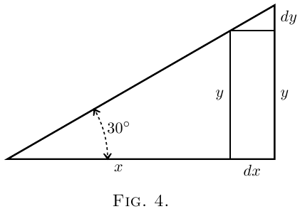
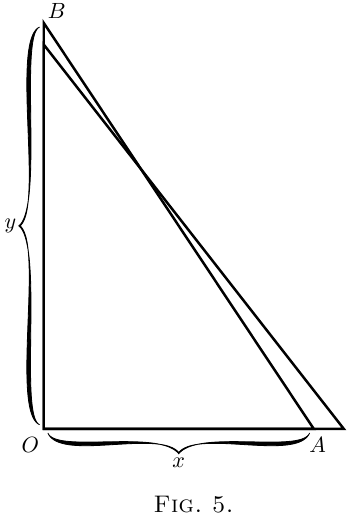

# О сравнительных изменениях

Во всём исчислении мы имеем дело с величинами, которые изменяются,
и со скоростями этих изменений.
Мы делим все величины на два класса: постоянные и переменные.

Те, которые мы считаем фиксированными, называются **постоянными**
и обозначаются обычно буквами из начала алфавита —
такими, как $a$, $b$, или $c$.

А те, которые могут меняться,
или (как говорят математики) *«варьироваться»*,
мы обозначаем буквами из конца алфавита — такими, как $x$, $y$, $z$, $u$, $v$, $w$,
и иногда $t$.

Обычно имеем дело сразу с несколькими переменными
и размышляем о том, как одна переменная зависит от другой:

- как высота, на которую поднимается снаряд, зависит от времени подъёма;

- или нас просят рассмотреть прямоугольник с заданной площадью и выяснить,
как увеличение его длины приведёт к соответствующему уменьшению ширины;

- или мы думаем о том, как любое изменение наклона лестницы
повлияет на высоту, на которую она достаёт.

Предположим, у нас есть две такие переменные, связанные друг с другом.
Изменение одной вызовет изменение другой — именно из-за этой зависимости.
Обозначим одну из переменных как $x$,
а другую, зависящую от неё, как $y$.

Пусть $x$ изменяется —
то есть мы либо действительно изменяем её,
либо мысленно представляем, что она изменилась,
прибавив к ней маленький кусочек, который мы называем $dx$.
Таким образом, $x$ становится $x + dx$.
Тогда, поскольку $x$ изменилась, $y$ тоже изменится
и станет $y + dy$.
Здесь $dy$ — тоже маленькое приращение,
которое в одних случаях может быть положительным, в других — отрицательным.
И оно (если только не случится чудо) не будет равным $dx$ по величине.

## Пара примеров

**(1)** Пусть $x$ и $y$ — соответственно основание и высота прямоугольного треугольника
(см. Fig 4), у которого наклон гипотенузы зафиксирован на $30^\circ$.

Давайте представим, что этот треугольник увеличивается в размерах,
но сохраняет свои углы неизменными, тогда при увеличении основания до $x + dx$
высота также изменится и станет $y + dy$.

Здесь увеличение $x$ приводит к увеличению $y$.

Маленький треугольник с основанием $dx$ и высотой $dy$ подобен исходному треугольнику.
А значит, их стороны пропорциональны, и:

$$
\frac{dy}{dx} = \frac{y}{x}
$$

При этом угол между основанием и гипотенузой равен $30^\circ$,
а значит, отношение противолежащего катета к прилежащему в этом треугольнике
равно $\tan(30^\circ)$.

Таким образом:

$$
\frac{y}{x} = \tan(30^\circ)
$$

Теперь вспомним, чему равно $\tan(30^\circ)$.

Представим равносторонний треугольник со стороной $2$.
Разрежем его пополам высотой — получим два прямоугольных
треугольника с углами $30^\circ$, $60^\circ$, $90^\circ$.  

В одном из них:

- гипотенуза = $2$
- прилежащий катет (половина основания) = $1$
- противолежащий катет (высота) = $\sqrt{2^2 - 1^2} = \sqrt{3}$

Следовательно:

$$
\tan(30^\circ) = \frac{1}{\sqrt{3}} \approx \frac{1}{1.73}
$$

И значит, в нашем случае:

$$
\frac{dy}{dx} = \frac{1}{\sqrt{3}} \approx \frac{1}{1.73}
$$

**(2)** Пусть $x$ — это горизонтальное расстояние от стены до нижнего конца
лестницы $AB$ постоянной длины (см. Fig. 5),
а $y$ — это высота, на которую лестница достаёт по стене.

Очевидно, что значение $y$ зависит от $x$.

Легко заметить: если немного отодвинуть нижний конец $A$
подальше от стены,
то верхний конец $B$ опустится немного ниже.

Скажем это научным языком: если мы увеличим $x$ до $x + dx$,
то $y$ уменьшится и станет $y - dy$.

То есть, когда $x$ получает положительное приращение,
приращение $y$ оказывается отрицательным.

Хорошо, но **насколько сильно** уменьшится высота?

Представим, что у нас есть длинная лестница.
Когда её нижний конец $A$ находится на расстоянии **1 метр** от стены,
верхний конец $B$ достигает высоты **9 метров** от земли.

Теперь, если немного выдвинуть нижний конец — скажем, ещё на **0.2 метра**
(20 см),насколько опустится верхний конец?

Зададим начальные значения:

- $x = 1$ м (расстояние от стены до нижнего конца),
- $y = 9$ м (высота, на которую лестница достаёт по стене).

Приращение $x$, то есть $dx = 0.2$ м,
новое значение: $x + dx = 1.2$ м.

Теперь воспользуемся теоремой Пифагора, чтобы найти длину лестницы:

$$
\text{длина лестницы} =
\sqrt{9^2 + 1^2} = \sqrt{81 + 1} = \sqrt{82} \approx 9.06 \text{ м}
$$

Эта длина остаётся постоянной.

Теперь найдём новую высоту при $x = 1.2$ м:

$$
y - dy = \sqrt{9.06^2 - 1.2^2}
= \sqrt{82 - 1.44} = \sqrt{80.56} \approx 8.97 \text{ м}
$$

Значит, высота уменьшилась примерно на:

$$
dy = 9 - 8.97 = 0.03 \text{ м} = 3 \text{ см}
$$

Итак, мы видим, что при увеличении $dx$ на **20 см**,
величина $dy$ уменьшилась на **3 см**.

Отношение $dy$ к $dx$ можно выразить так:

$$
\frac{dy}{dx} = \frac{-3}{20} = -0{,}15
$$

Нетрудно заметить, что (за исключением одного-единственного положения)
величины $dy$ и $dx$ будут отличаться друг от друга — как по знаку, так и по размеру.

Теперь важно понять: всё исчисление по сути посвящено
поиску одной странной вещи — **отношения**,
а именно того, в какой **пропорции $dy$ связано с $dx$**,
если оба становятся бесконечно малыми.

Надо помнить: мы можем найти это отношение $\dfrac{dy}{dx}$
только если $x$ и $y$ каким-то образом связаны между собой.
То есть так, что при изменении $x$ обязательно изменяется и $y$.

Например:

- в первом случае (треугольник), если увеличить основание $x$,  
  высота $y$ тоже увеличивается — и пропорционально;
- во втором случае (лестница), если увеличить расстояние $x$ от стены,  
  то высота $y$, которой достаёт лестница, наоборот, уменьшается —  
  сначала медленно, потом всё быстрее по мере роста $x$.

В этих случаях связь между $x$ и $y$ абсолютно точная, её можно выразить математически:

- в первом случае:  
  $$
  \frac{y}{x} = \tan(30^\circ)
  $$

- во втором случае:  
  $$
  x^2 + y^2 = l^2,
  $$
  где $l$ — длина лестницы.

И в каждом случае выражение $\dfrac{dy}{dx}$ имеет чёткий, конкретный смысл.

Если же, как и прежде, $x$ обозначает расстояние от стены до нижнего конца лестницы,
а $y$ теперь — **не** высота, на которую лестница достаёт,
а, скажем, длина стены в горизонтальном направлении,
или количество кирпичей в ней,
или количество лет с момента её постройки —
тогда любое изменение $x$ **никак не повлияет на $y$**.

В таком случае выражение $\dfrac{dy}{dx}$ **не имеет никакого смысла**,
и невозможно найти никакое разумное выражение для него.

Когда мы используем дифференциалы $dx$, $dy$, $dz$ и т. д.,
**мы всегда подразумеваем, что между переменными**
**$x$, $y$, $z$ и т. д. есть какая-то связь.**
Эта связь и называется **функцией** переменных $x$, $y$, $z$ и т. д.

Например, два выражения, которые мы уже встречали:

- $ \displaystyle \frac{y}{x} = \tan(30^\circ) $

- $ \displaystyle x^2 + y^2 = l^2 $

— это функции от $x$ и $y$.

Они содержат (неявно, то есть не обязательно в готовом виде)
возможность выразить $y$ через $x$ или наоборот — $x$ через $y$.

Поэтому такие выражения называют **неявными функциями**
*(implicit functions)* от $x$ и $y$.

Эти выражения можно явно переписать в виде:

- из первого:  
  $$
  y = x \cdot \tan(30^\circ) \quad \text{или} \quad x = y \cdot \tan(30^\circ)
  $$

- из второго:  
  $$
  y = \sqrt{l^2 - x^2} \quad \text{или} \quad x = \sqrt{l^2 - y^2}
  $$

Выражения, приведённые выше, **явно** (то есть в явном виде)
выражают значение $x$ через $y$, или $y$ через $x$, и поэтому
они называются **явными функциями** *(explicit functions)* переменной $x$ или $y$.

Например, уравнение:

$$
x^2 + 3 = 2y - 7
$$

— это **неявная функция** переменных $x$ и $y$.

Её можно переписать в явном виде:

- как функцию $x$:
  $$
  y = \frac{x^2 + 10}{2}
  $$

- или как функцию $y$:
  $$
  x = \sqrt{2y - 10}
  $$

Таким образом, **явная функция** от $x$, $y$, $z$ и т. д. —
это просто выражение, значение которого изменяется,
когда изменяются переменные $x$, $y$, $z$ и т. д.
(либо по одной, либо одновременно несколько).

Именно поэтому значение такой функции называют **зависимой переменной**,
поскольку она **зависит** от значений других переменных,
входящих в функцию.

А переменные, от которых зависит функция, называют
**независимыми переменными**,
потому что их значения не определяются самой функцией.

Например, если:

$$
u = x^2 \cdot \sin \theta,
$$

то $x$ и $\theta$ — **независимые переменные**,
а $u$ — **зависимая переменная**.

Иногда точная связь между несколькими величинами — например, $x$, $y$, $z$ —
либо **неизвестна**, либо **неудобна** для явного указания.
В таких случаях нам лишь известно (или удобно говорить),
что между этими переменными **какая-то зависимость есть**,
и что нельзя изменить $x$, $y$ или $z$ по отдельности,
не повлияв при этом на остальные.

Существование такой зависимости обозначают с помощью записи:

- **неявная функция:**  
  $$
  F(x, y, z)
  $$

- **явные функции:**  
  $$
  x = F(y, z), \quad y = F(x, z), \quad z = F(x, y)
  $$

Иногда вместо буквы $F$ используют $f$ или $\varphi$,
поэтому записи вроде:

- $y = F(x)$  
- $y = f(x)$  
- $y = \varphi(x)$  

все означают одно и то же: **значение $y$ каким-то образом
зависит от $x$, но конкретный способ зависимости не уточняется.**

Теперь давайте вернёмся к основному объекту нашего интереса — отношению:

$$
\frac{dy}{dx}
$$

Это отношение называют **дифференциальным коэффициентом функции $y$ по $x$**.

Да, звучит «научно» и громоздко, но сама суть — **совсем несложная**.

И если нас пугает не само понятие,
а только тяжеловесное название —
вместо того чтобы пугаться,
мы просто мысленно выскажем всё, что думаем
о глупости таких заумных терминов —
и спокойно продолжим рассматривать
вот эту простую штуку:

$$
\frac{dy}{dx}
$$

В обычной алгебре, которую ты изучал в школе,
всё сводилось к поиску **неизвестной величины** —
ты называл её $x$ или $y$.
Иногда приходилось искать сразу **две неизвестные**,
решая уравнения, чтобы выяснить, чему равны $x$ и $y$ одновременно.

Теперь тебе предстоит **научиться искать по-новому**.
На этот раз цель охоты — **не $x$ и не $y$**.

Теперь ты охотишься за странным зверьком по имени $\dfrac{dy}{dx}$.

Процесс нахождения значения этого выражения называется **дифференцированием**.

Но заметь: нас интересует **значение этой дроби,**
**когда и $dy$, и $dx$ — бесконечно малы**.
Истинное значение дифференциального коэффициента —
это то, к чему стремится отношение $\dfrac{dy}{dx}$
в **пределе**, когда и числитель, и знаменатель становятся **столь малы,
что меньше уже некуда**.

А теперь давай научимся, **как охотиться за $\dfrac{dy}{dx}$**.

## Примечание к Главе III. Как читать дифференциалы

Очень важно **не попасть в школьную ловушку**, думая, что $dx$ означает
"буква $d$ умножается на $x$".

Это **не так** — здесь $d$ **не множитель**.

Буква $d$ означает «маленький кусочек» или **«элемент»** того, что следует за ней.

То есть $dx$ читается как: **«ди-икс»**, а не «d умножить на $x$».

Если у читателя нет наставника, который мог бы объяснить такие вещи,
вот простое правило, **как читать дифференциальные коэффициенты**:

- $\dfrac{dy}{dx}$ читается:

  **«ди-игрек по ди-икс»** или **«ди-игрек делённое на ди-икс»**

- $\dfrac{du}{dt}$ читается:

    **«ди-у по ди-тэ»**

### Вторые производные

Позже мы встретимся со **вторыми производными** —
они записываются, например, как:

$$
\frac{d^2y}{dx^2}
$$

Это читается как:
**«ди-два-игрек по ди-икс в квадрате»**.

Это означает, что операция дифференцирования по переменной $x$
была (или должна быть) выполнена **дважды подряд**.

### Альтернативная запись: штрихи

Существует и другой способ показать, что функция
продифференцирована:
ставится **штрих** к обозначению функции.

Если, например:

$$
y = F(x)
$$

(то есть $y$ — это некая функция от $x$),
то можно записать производную так:

$$
F'(x)
$$

вместо полной формы:

$$
\frac{d(F(x))}{dx}
$$

А если функция продифференцирована **дважды**, то:

$$
F''(x)
$$

означает, что функция $F(x)$ продифференцирована **два раза** по переменной $x$.
